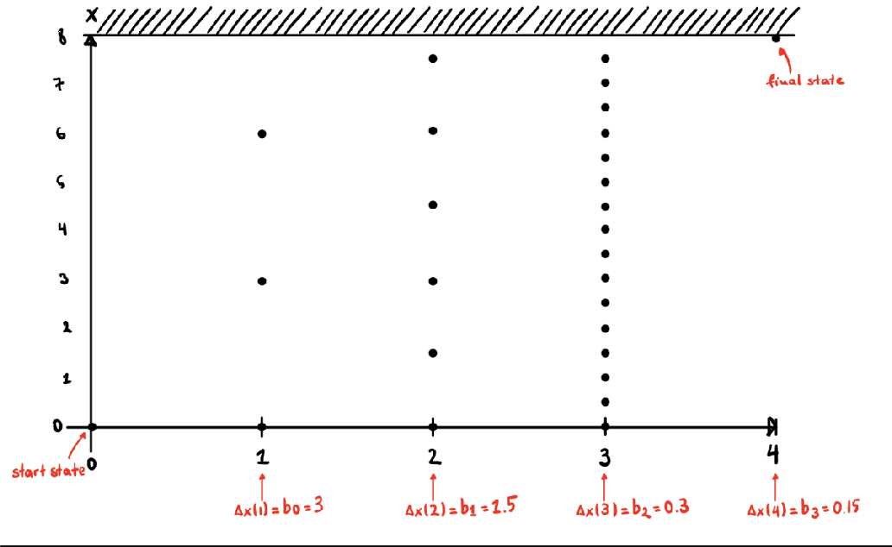
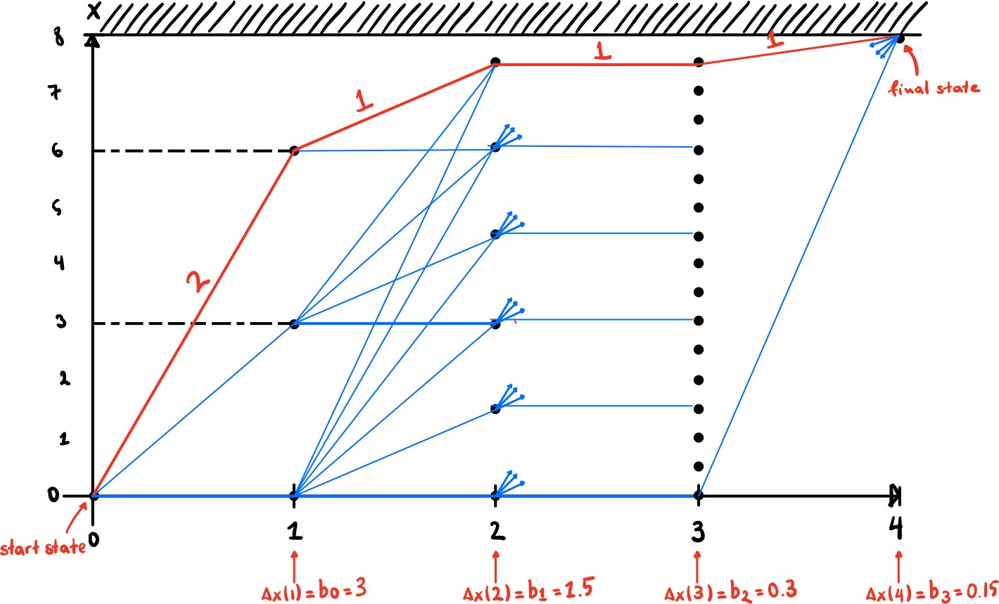

# 2nd Exercise
## Purpose - Answering the Questions
Exercise for solving a problem of optimal load distribution. 
The problem is the transfer of K-1 electronic components with bK and wK (weight and value, respectively) 
from area A to area B with total weight limit B, in order to find the load distribution that maximizes its total value. 
The purpose is to solve this problem in C programming language using Discrete Programming Dynamics.

It was necessary to find a statutory equation under constraints as well as a load value criterion.

1. Determination of optimal control problem with load value criterion
    1. **Statutory Equation:**  𝒙(𝒌 + 𝟏) = 𝒙(𝒌) + 𝒖(𝒌) ∙ 𝒃𝒌,𝒙(𝟎) = 𝟎 
    2. **Restrictions:**   𝒖(𝒌) ∈ {𝟎,𝟏,𝟐,…},𝟎 ≤ 𝒙(𝒌) ≤ 𝑩 
    3. **Cargo Value Criterion:**   𝑱 = ∑ 𝒖(𝒌) ∙ 𝒘𝒌
2. Through the program developed and based on the data of question C it appears that the optimal distribution is:  
𝒖(𝟎) = 𝟐 ,𝒖(𝟏) = 𝟏,𝒖(𝟐) = 𝟏,𝒖(𝟑) = 𝟏   With maximum cargo value:   𝑻𝒐𝒕𝒂𝒍 𝒗𝒂𝒍𝒖𝒆 = 𝟐𝟕.𝟔 

## Grid Construction 
We first constructed the problem grid based on the program inputs with:  
𝜟𝒙(𝟏) = 𝒃𝟎 = 𝟑,𝜟𝒙(𝟐) = 𝒃𝟏 = 𝟏.𝟓,𝜟𝒙(𝟑) = 𝒃𝟐 = 𝟎.𝟑,𝜟𝒙(𝟒) = 𝒃𝟑 = 𝟎.𝟏𝟓 

## Finding Optimal Control and Transition Costs
   During this process we find for each node of each level the transition cost that maximizes the load value criterion. This results in the optimal red transitions shown in the image below.

