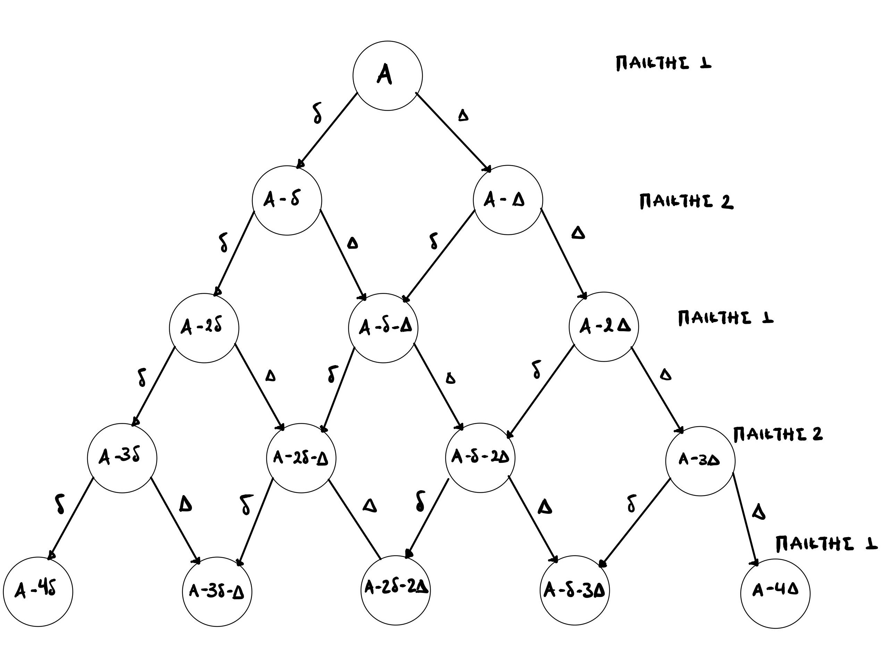
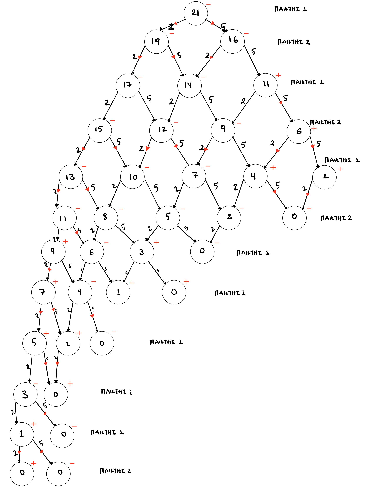

# Dynamic Programming in C
## 1st Exercise
### Purpose
Exercise in a children's game of two people who stand facing each other at a distance A and have the ability to move D and d (D> d).
The purpose is to resolve the game in C programming language using Dynamic Programming.
Min-Max Regression was used to find the optimal solution of the individual subproblems depending on the profile of each player.
### Implementation
#### Construction of Decision Tree
Given the initial distance A and the magnitudes of the movements D and d.
Having the inputs we construct the tree as shown in the corresponding appendix of the theoretical part of the pronunciation.
The construction process is done in an iterative way and has as a terminal control the value of the current node to have a positive value.
Then we apply an iterative procedure for each level and for each node of the tree where we determine the optimal movement.



#### Finding the Best Decision
In this process we assume that the player who starts the game has a goal and we consider that he plays optimally when he maximizes the available costs.
While the second player in a row we consider that he plays optimally when he minimizes the available costs. So, taking into account the profile of each player,
we perform the appropriate action, whether we choose the max or the min. 
This maximization allows us to find the optimal path and conclude that any player who starts the game is **doomed** to lose.



An example print format is:
```
**Level 3**: **Player 1** is playing and wants to **maximize**  
Left aka node-2(d): **7** Right aka node-5(D): **-12**  
The optimal move is **d**  
```
### Execution Method

gcc main.c